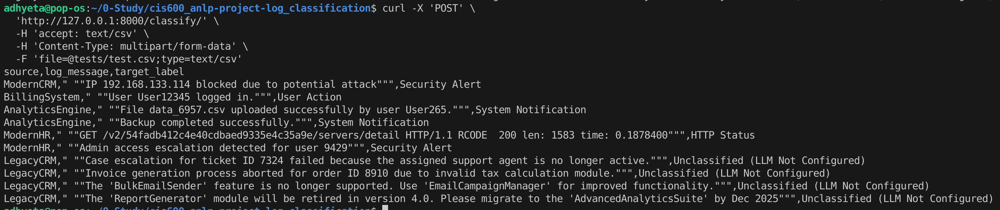

Some structure

```
project_root/
├── app/
│   ├── __init__.py
│   ├── main.py                # Renamed from server.py
│   ├── config.py              # NEW: Central configuration
│   ├── services/
│   │   ├── __init__.py
│   │   └── classifier.py      # Logic from classify.py
│   └── processors/            # NEW: Group all processors here
│       ├── __init__.py
│       ├── base.py            # NEW: Abstract base class
│       ├── regex.py           # Renamed from processor_regex.py
│       ├── bert.py            # Renamed from processor_bert.py
│       └── llm.py             # Renamed from processor_llm.py
├── models/
│   └── log_classifier.joblib
├── tests/                     # NEW: dedicated test folder
│   └── test_api.py
├── requirements.txt
└── README.md
```


## TEST:
```bash
curl -X 'POST' \
  'http://127.0.0.1:8000/classify/' \
  -H 'accept: text/csv' \
  -H 'Content-Type: multipart/form-data' \
  -F 'file=@tests/test.csv;type=text/csv'
```
